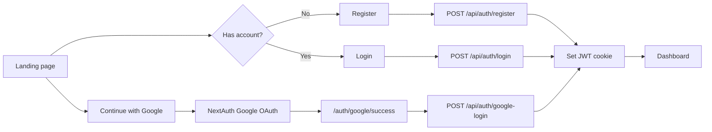
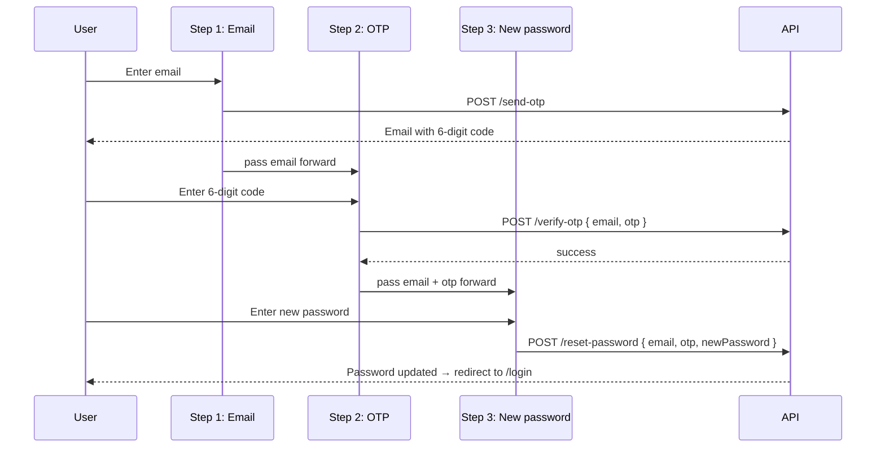
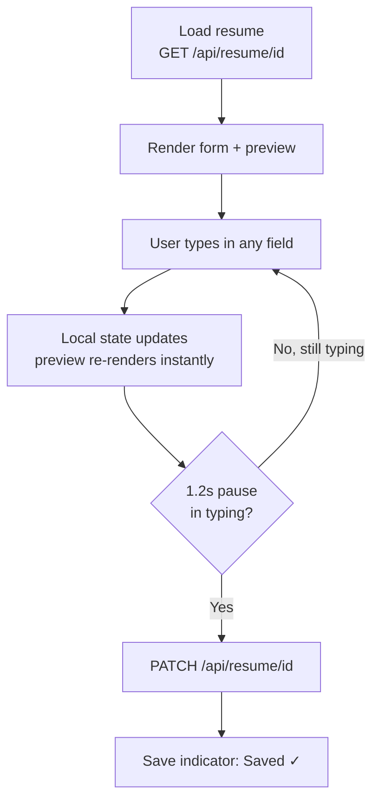
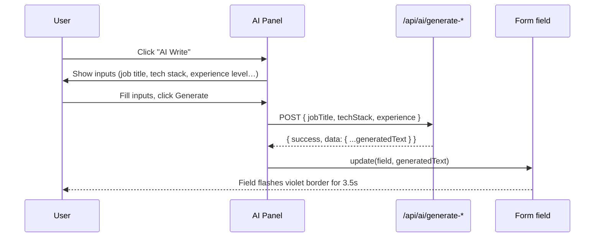
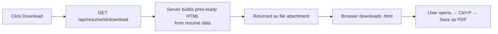

# Makresume

A resume builder with live ATS scoring, AI-assisted writing, and one-click PDF export — built with Next.js (App Router), MongoDB, and the Anthropic/OpenAI-style completion API.

---

## Table of contents

- [Overview](#overview)
- [Tech stack](#tech-stack)
- [Authentication flow](#authentication-flow)
- [Resume editor flow](#resume-editor-flow)
- [AI generation flow](#ai-generation-flow)
- [Download flow](#download-flow)
- [Data model](#data-model)
- [Getting started](#getting-started)

---

## Overview

makresume lets a user sign up, build a resume section by section, see a live formatted preview as they type, get an AI-generated summary/experience/project description/skills list on demand, watch an ATS compatibility score update in real time, and download a finished resume — all without leaving the editor.

```
Landing page → Sign up / Sign in → Dashboard → Resume editor → Download
                     ↑
              Forgot password (3 steps)
```

---

## Tech stack

| Layer | Choice |
|---|---|
| Framework | Next.js 14 (App Router) |
| Styling | Tailwind CSS |
| Icons | lucide-react |
| Database | MongoDB + Mongoose |
| Auth | JWT (httpOnly cookie) + Google OAuth via NextAuth |
| AI | Server-side completion API (`generateAIResponse`) |
| Email (OTP) | `lib/email.ts` (SMTP) |

---

## Authentication flow

Two paths into the app: email/password, or Google OAuth.



**Forgot password** is a separate 3-step flow. The email is captured once in Step 1 and carried through component state — the user is never asked to re-type it.



---

## Resume editor flow

The editor is a split-pane layout: a tabbed form on the left, a live document preview on the right. Every keystroke updates local state immediately (so the preview feels instant) and triggers a **debounced auto-save** 1.2 seconds after the user stops typing.



### Responsive layout

| Screen | Editor | Preview |
|---|---|---|
| Mobile (`< sm`) | Full width, icon-only tabs | Full-screen modal, opened via button |
| Tablet (`sm–lg`) | Full width, labelled scrollable tabs | Full-screen modal |
| Desktop (`lg+`) | Fixed ~440px left pane | Always-visible right pane |

```
Desktop (lg+)                          Mobile (< lg)
┌─────────┬──────────────┐             ┌──────────────────┐
│  Tabs   │              │             │   Top bar + ⊙Preview│
├─────────┤  Live Preview│             ├──────────────────┤
│  Form   │              │             │  Tabs (scrollable) │
│ section │              │             ├──────────────────┤
│         │              │             │      Form          │
└─────────┴──────────────┘             ├──────────────────┤
                                        │  [Preview resume]  │  ← opens
                                        └──────────────────┘    full-screen
```

---

## AI generation flow

Three sections — **Summary**, **Skills**, **Experience**, and **Projects** — have an "AI Write / AI Suggest" button. Clicking it opens an inline panel asking for the minimum inputs the underlying API needs. The generated text is written directly into the relevant field; nothing is copy-pasted manually.



| Section | Inputs required | Output target |
|---|---|---|
| Summary | Job title, skills, experience level | Summary textarea |
| Skills | Job title, experience level | Skill chips (merged + deduplicated) |
| Experience | Job role, tech stack, level, years | That entry's description |
| Projects | Job title, tech stack, level | That project's description |

The user can always type manually instead — AI is additive, never required.

---

## Download flow



> The route is built so a Puppeteer/wkhtmltopdf step can be dropped in later to return raw `.pdf` bytes instead of `.html`, without changing anything on the frontend.

---

## Getting started

```bash
npm install
npm run dev
```

Visit `http://localhost:3000`.

| Page | Path |
|---|---|
| Landing | `/` |
| Sign up | `/register` |
| Sign in | `/login` |
| Forgot password | `/forgot-password` |
| Dashboard | `/dashboard` |
| Resume editor | `/resume/[resumeId]` |